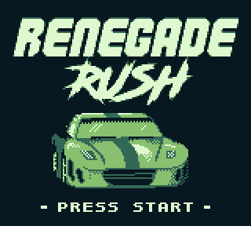

# Renegade Rush

A work-in-progess homebrew game for the Gameboy.

## Building
Requirements:

- [RGBDS](https://github.com/gbdev/rgbds)
- [Python 3](https://www.python.org/)
- [GNU Make](https://www.gnu.org/software/make/)

Just run `make` in the root directory, which will produce the ROM `RenegadeRush.gb` in the `bin` folder.

## Assets Used
- [hUGEDriver](https://github.com/SuperDisk/hUGEDriver) by SuperDisk
- [WitchFont8](https://lavenfurr.itch.io/witchfont8) by Lavenfurr
- [Spy Fighter Asset Pack](https://chasersgaming.itch.io/asset-pack-spy-fighter-gb) by Chasersgaming
- [Misc Gameboy Assets](https://materialfuture.itch.io/gameboy-assets) by MaterialFuture